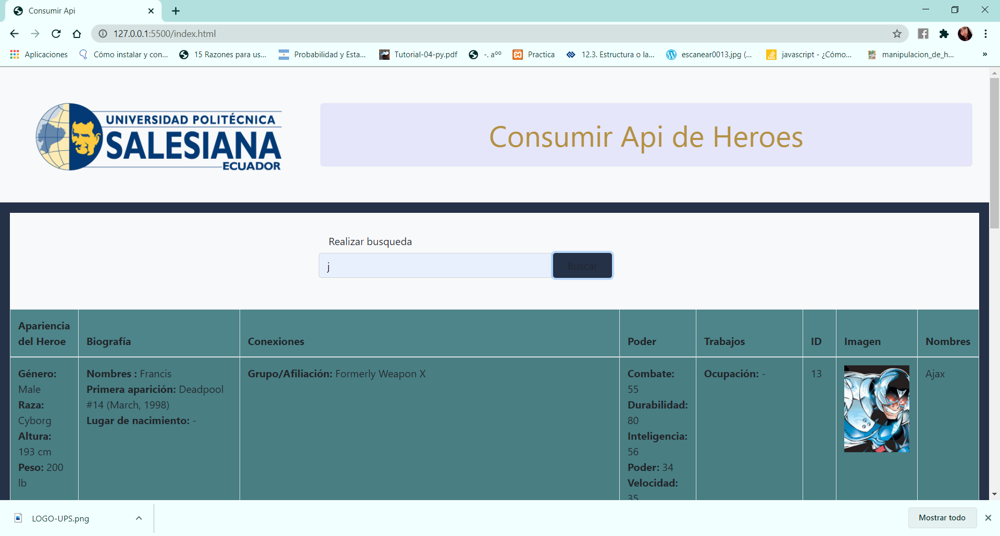
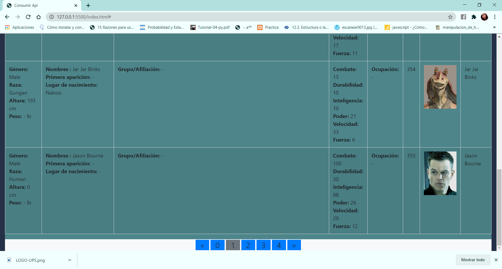

 
Desarrollo de una aplicación web utilizando la API de la base de datos de películas OMDB

OBJETIVO ALCANZADO:
• 	Conocer las arquitecturas y patrones arquitectónicos web para el diseño de aplicaciones web 
• 	Interactuar con servicios web de plataformas en la nube 

ACTIVIDADES DESARROLLADAS 

1.	Identificar gráficamente la arquitectura y el patrón de diseño de la aplicación a desarrollar. 

</img>

2.	Generar una llave para consumir los servicios web de la API (opcional, depende de la API seleccionada).
URL DE API: https://superheroapi.com/api.php/3275332375923204/search/

Para poder la API es necesario crear un Access-token, por lo cual se creo una cuenta mediante FACEBOOK, de esta forma hay la accesibilidad a la API
3.		Crear un repositorio en GitHub con el nombre “Practica00 – Consumo de APIs en la nube” 
Usuario: jessica-maribel
Link del repositorio : https://jessica-maribel.github.io/Practica00-Consumo-de-APIs-en-la-nube/ 
4.	Desarrollar una aplicación con HTML + CSS + Javascript + Web Services para buscar información y visualizar toda la información disponible a través de la API.  
•	La API de Superhero tiene como datos los siguientes 
	Id: se realiza la búsqueda por el id del personaje y se encarga de devolver la información del personaje.
	Powerstats : devuelve JSON Array de todas las estadísticas de potencia de un carácter determinado
	Biography: devuelve JSON Array de la biografia del personaje
	Apperance : devuelve la apariencia del personaje
	Work: obtiene el trabajo que se encarga de realizar el personaje, como la ocupación que tendrá dentro del juego y las operaciones que realiza el héroe.
	Connections: devuelve el array de conexiones
	Image: se obtiene la imagen de los personajes
	Buscar por el Nombre: se busca por el nombre del personaje

•	Realizando Búsqueda dentro de la página WEB

</img>

•		Realizado la paginación

</img>

	
Experiencia de Usuario: Es importante tomar en consideración sobre los aspectos de interacción del usuario final, ya que en general se busca mejorar la satisfacción del usuario mediante la usabilidad, accesibilidad mientras navegue por la página web o sitio web. 
1.	Jerarquía de Información: es de permitir mejorar la comprensión del producto diseñado, priorizando la información más relevante y tener un lenguaje visual claro.
2.	Titulares grandes: que permitan encabezar secciones que los usuarios puedan tener ayuda identificando el contenido.

RESULTADO(S) OBTENIDO(S):

•	Como resultado de la práctica se puede decir que con la ayuda de esta práctica se entiende la implementación de arquitecturas y patrones arquitectónicos de acuerdo con el desarrollo se comprende que tenemos un tipo de arquitectura modelo controlador y vista “MVC”, por lo que se implementó con plataformas de la nube.

CONCLUSIONES:

•	Es necesario saber sobre los patrones arquitectónicos ya que con estos nos permite que el desarrollo tenga una construcción, por lo cual se encargan de describir.

•	Además de ello, es necesario aplicar buenas prácticas para el desarrollo ya que se debe conocer la implementación de experiencia de usuario esto nos facilita con los aspectos de interacción al usuario

RECOMENDACIONES:

•	Haber asistido a las secciones de clases

•	Se recomienda revisar el contenido teórico de la asignatura

•	Revisar la documentación sobre BootStrap para la realización de esta práctica.

•	Tener conocimiento previo sobre el manejo de los css.

